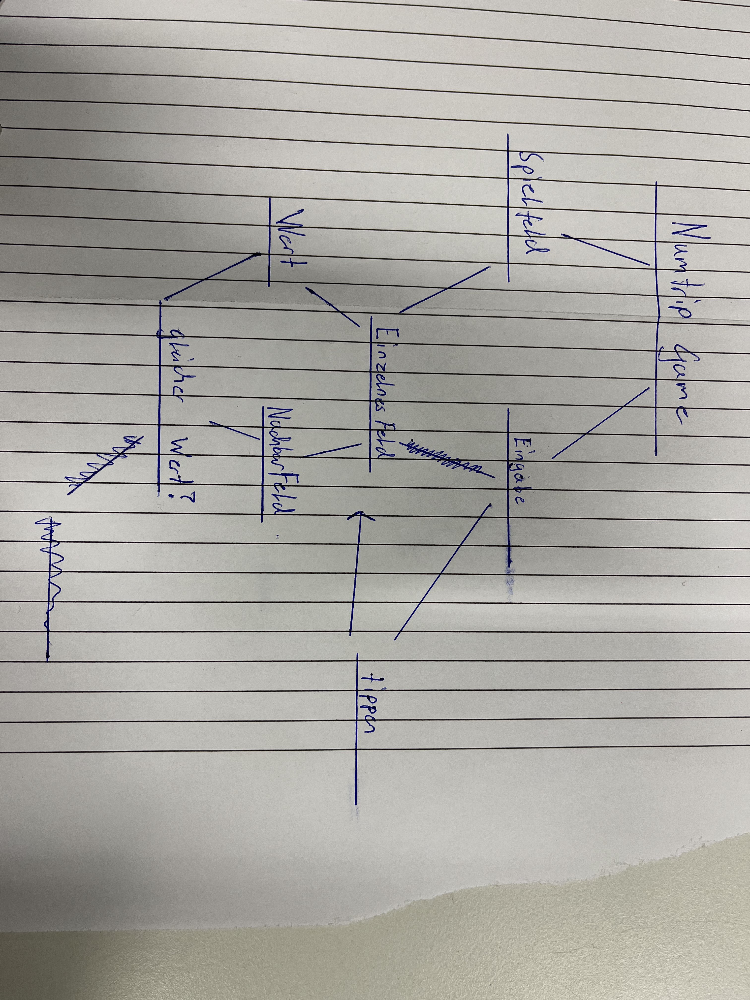
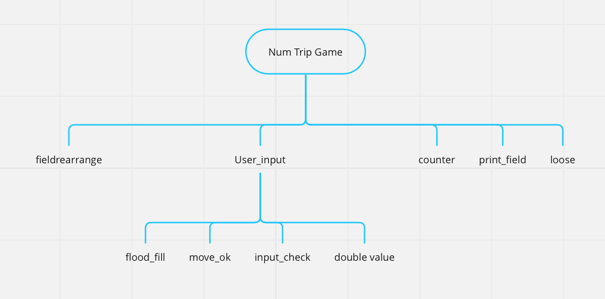
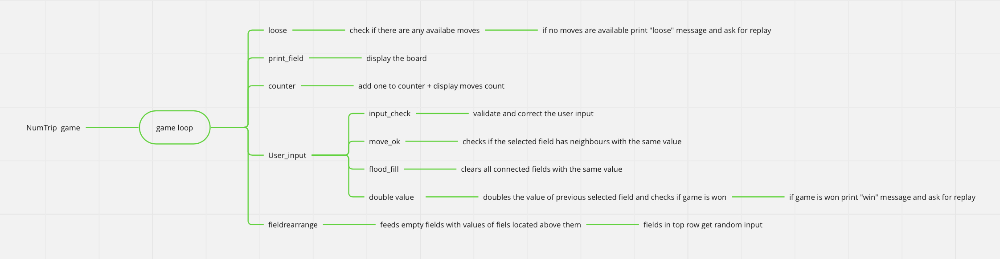

# Finaler Blogeintrag
## Ziel des Spiels/Projekts
NumTrip ist ein simples python-Konsolen Spiel. Wir haben ein Spielfeld welches aus 5x5 Feldern mit veschiedenen Zahlen(Werten) besteht. Felder, welche ein angernzendes Feld mit derselben Zahl haben kann man auswählen und der Wert im ausgewählten Feld verdoppelt sich. Die angrenzenden Felder werden geelert und mit zufälligen neuen gefüllt. Man gewinnt das Spiel indem man einen bestimmten wert Erreicht ohne das einem die Möglichkeiten weitere Züge zu machen ausgehen. Falls du fragen hast, probiel das Spiel doch einfach aus. 

## Was wird zum spielen des Spieles benötigt:
Damit du das Spiel auch spielen kannst, benötigst du eine Phyton Konsole, auf welcher Phyton läuft. Dafür musst du zuerst einmal [Python](https://www.python.org/shell/) installieren. Mein Spiel spielst du vorzüglicherweise in VSC, da mein Spiel die Erweiterung ["Colorama"](https://pypi.org/project/colorama/) benötigt, damit in der Konsole die Farben von meinem Spiel angezigt werden können und es nicht aufgrund von fehlenden Voraussetzungen abstürzt. 


## Neuer Top Down Entwurf:
### Top Down Entwurf vor dem programmieren:

### Top Down Entwurf nach dem programmieren:

### Hier eine Beschiebene Version:


# Algorythmisches Konzept: 
## Felder Auffüllen


Dieser Teil des Spieles ist eigentlich Ziemlich simpel. wir müssen eine Funktion programmieren, welche bei leeren Feldern die Zahl aus dem Feld darüber nimmt. 

Später müssen wir der Funktion noch die Möglichkeit geben bei den Obersten Feldern eine zufällige Zahl zu importieren. 

Da mir dieses Problem zu gross war, habe ich zuerst in einem Seperaten Dokument gearbeitet. 

* Vorgehensweise:
* 1. Simple Liste erstellen 
* 2. Für jeden einzelnen Wert in den Zeilen wiederholen 
* 3. Falls oberste Zeile, zufallszahl einfügen 
* 4. mithilfe des Indexes werte von Feldern überschreiben
* 5. Für jede Zeile wiederholen 

Ich habe noch keine bessere Option dafür gefunden als das Programm für jede Zele zu wiederholen, da ich keine gute möglichkeit hatte zu überprüfen ob es keine Leeren felder auf dem Spielfeld gibt. 

````py
field = [[1,2, ' '], [' ',' ', ' '],[ ' ', ' ' , ' ']]  # 1.
save = []

import random
random.seed(2)
numbers = [1, 2, 4, 8]

def fieldrearrange():
    for i in range(5):     # 5. 
        for x in field:

            print(field.index(x))
            for y in x :                # 2. 
                
                print(x.index(y))
                if y == ' ' :

                    if field.index(x) <= 0:                            # 3. 
                        field[0][x.index(y)] = random.choice(numbers)
            
                    if field.index(x) > 0:      # 4. 
                        save = field[field.index(x) - 1][x.index(y)]
                        field[field.index(x) - 1][x.index(y)] = ' '
                        field[field.index(x)][x.index(y)] = save
                        save = []

fieldrearrange()   
print(field)
````


# Schwierigkeiten des Projektes:

Da dies mein erstes grösseres Programmier-projekt war, hatte ich so einige Schwierigkeiten, welche sich aus verschiedensten Faktoren zusammensetzen. Das nicht vertraut sein mit Python oder VSC, oder das simple überfodert sein aufgrund fehlender kreativität zur umsetzung. Meiner meinung nach war meine grösste Schwierigkeit/Problematik dieses Projektes mein Zeitmanagement. Ich habe gelernt, dass wenn man selbst gut im Zeitpaln liegt schnell zurückfallen kann wenn man nach dem Konzept von **try and error** arbeitet. Es kann schnell passieren, dass man nicht das sich gesetzte Ziel erreicht und sich eine Lösung findet. Ich habe mich bei diesem Projekt mehrmals erwischt wie ich etwas für 30-45min ausprobiert habe und es schlussendlich wieder komplett verworfen habe, da ich eine andere herangehensweise für besser hielt. Das ganze ist im grunde auch nicht so Problematisch, wenn da ich relativ viel spass bei der Arbeit hatte. Jedoch kann das ganze problematisch werden, wenn man sich daurch in der Zeit verkalkuliert oder verliert.                                                                                                    
## Meine Tipps an dich:

* **Tipps im Allgeminen**
    * Tausche dich mit anderen aus
    * frage bei deinen Lehrern/Mitschülern nach
    * Falls du noch nicht so erfahren bist und es nicht auf Anhieb funktioniert, lass dich dadurch nicht Frustrieren und Arbeite an einem anderen Tag weiter
 * **Tipps spezifisch für dieses Projekt:**
    * Lies dir die Theorie für 2-Dimensionale Listen in Python nochmals durch 
    * Versuche dich an die empfohlene/vorgegebe Struckturierung zu halten 
