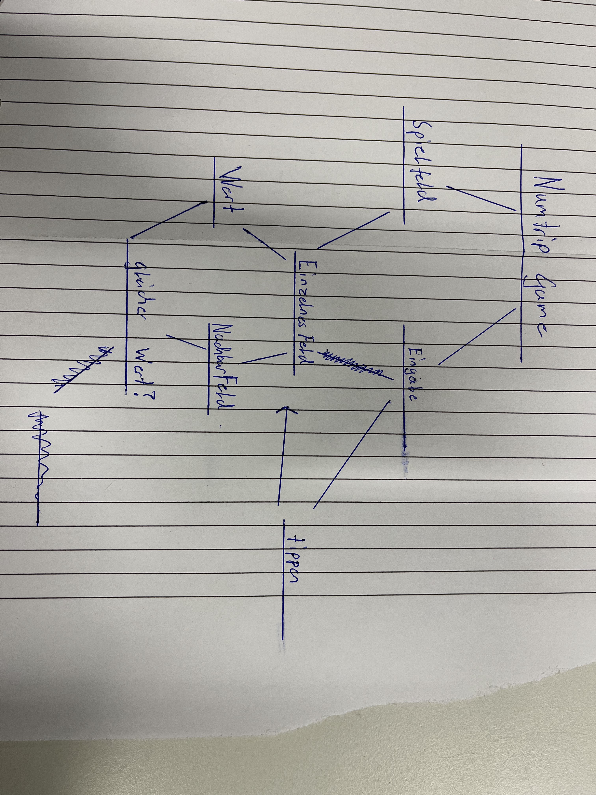

# Top down entwurf Numtrip

**Das Game besteht im grossen und ganzen aus einem Spielfeld, in welchen die Zahlenwerte generiert, dargestellt und verändert werden.** 

* Wir haben ein Spielfeld und die jeweilige Eingabe zu einem bestimmten Feld.  
*(Die Eingabe wurde zu diesem Zeitpunkt schon auf Fehler überprüft.)*
* Dabei müssen wir den Wert des Feldes Abrufen können. 
* Später muss überprüft werde ob ein Nachbarfeld den selben wert hat.  
*(bestenfalls rekursiv da dann die nächsten Felder auch überprüft werden...)*

---

