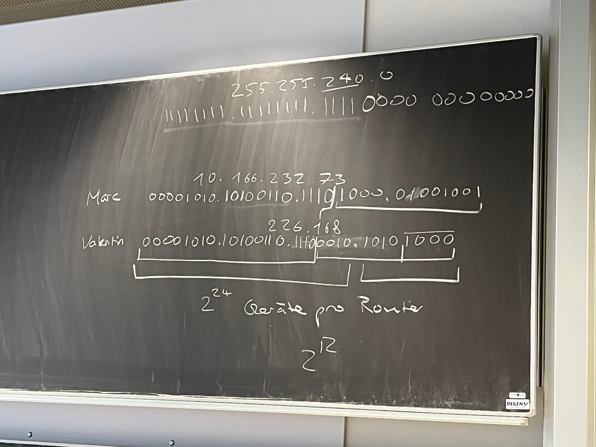

# Video-Kurse 3-8 

## 3. Vom LAN zum Internet

### Video 1 

Host
IP-Adresse
Netzwerke 

Wer/Was ist das isps?

### Video 2 

Repeater (Minecraft refrence?)

Wie Lang ist die Signalstärke eines LAN-Kabels? Kann ich mit meinem Kollegen, welcher 5 Häuser weiter wohn Minecraft LAN spielen, wenn ich ein Kabel zwischen den Zwei Häusern verlege?

Switsches Regulieren Datenverkehr zwischen verschiedenen Hosts innnerhalb einer Netzwerkes. 
Router regulieren den  Datenverkehr zwischen verschiedenen Netzwerken. 
Ein Beispiel für einen Router wäre der WLAN Kasten, welcher bei jedem Zuhause steht. 

Können verschiedene Hosts, welche sich im selben WLAN befinden nachrichten untereinader austauschen?

Gibt es Router, welche zur selben Zeit auch Switches sind?

Und für was werden Switches heutzutage überhaubt noch gebraucht?
    -Sind diese besser im transferieren von sehr grossen Datenmengen? 

## 4. IP-Adressen

Minecraft im LAN zu spielen ist eigentlich  noch ziemlich einfach. 

## 5. Schichtenmodell
   
Übertragungsmedium

Warum nicht einfach mehrere Kupferkabel anstatt eines Glasfasekabels?

OSI Modell 

   
  

## 6. Netzwerkzugangsschicht

## 7. Routing

## 8. Übersicht

## Switch 
Switches facilitate communication within a network
## MAC-Adresse
Adresse des 
## IP Adresse 
Adresse des Persönlichen User Gerätes 
## Router

## Gateway

## MAC-Tabelle

## Routing-Tabelle

## Ethernet-Frame

## ARP
Adress Resolution Protocoll 
Verbindet die Ebenen 2 + 3
Fragt mit einem Brodcast nach MAC Adressen

Protokoll für die Übersetzung von Adressen der Internetschicht auf Adressen der Netzzugangsschicht 