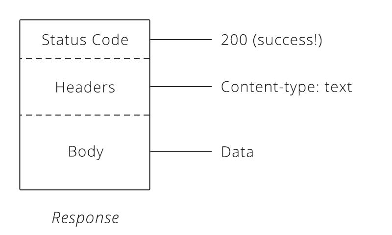
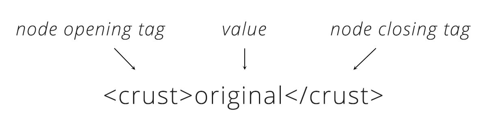
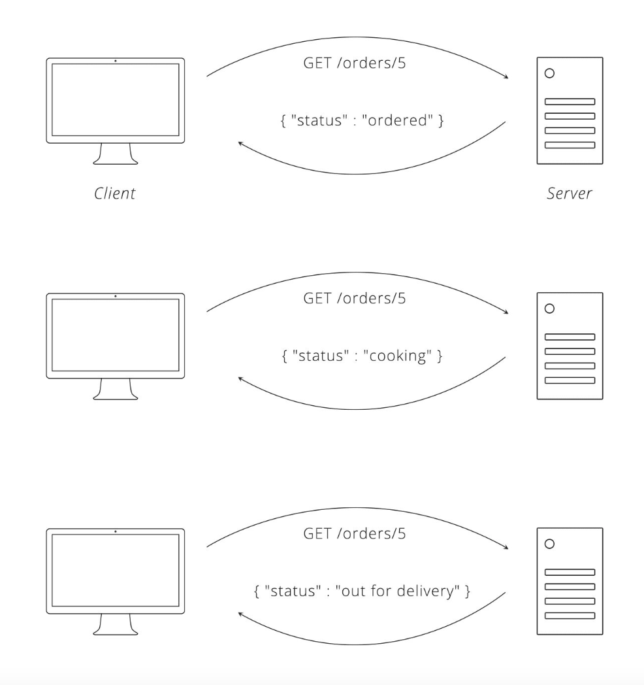
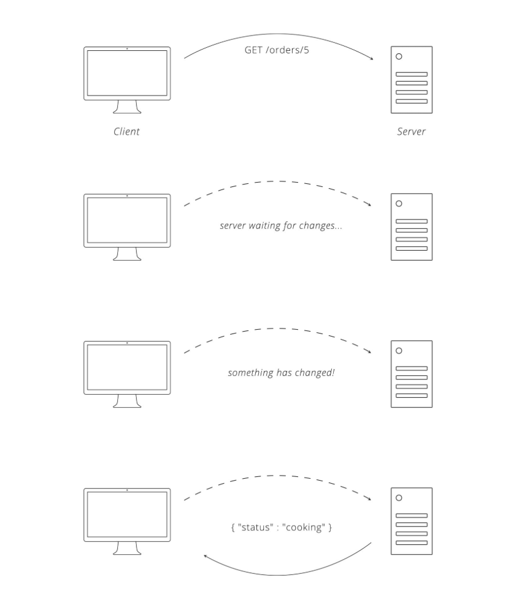

# API's

## Was ist eine API?

**API** steht für (application programming interfaces)

Eine API verarbeitet daten von Webseiten um sie auf einem Computer(Server zu speichern).

Die API ist der "verteckte" Teil einer Webseite welche für das Prozessieren vom Computer gedacht ist. Wenn wir 

## HTTP Request, HTTP Abfrage

*Inhalt der HTTP-Request*
### URL, Uniform Resource Locator
Wenn Sie eine Webadresse wie zu Beispiel http://example.com in einen Webbrowser eingeben, teilt das "http" dem Browser mit, dass er die HTTP-Regeln für die Kommunikation mit dem Server verwenden soll.

Adresse des Servers, mit welchem kommuniziert werden soll. 

### Methoden

Teilt dem Server die Aktion mit, welche Ausgeführt werden soll. 

**GET** - Fordert den Server auf, eine Ressource abzurufen  
**POST** - Aufforderung an den Server, eine neue Ressource zu erstellen  
**PUT** - Fordert den Server auf, eine vorhandene Ressource zu bearbeiten/zu aktualisieren  
**DELETE** - Fordert den Server auf, eine Ressource zu löschen

### Headers

Beinhaltet meta Informationen, welche für den Server relevant sind. 
Zum Beispiel Von welchen gerät die Anfrgae gesndet wird, die Uhrzeit der Anfrage.
Im Header wird auch erklärt welche Aktion durchgeführt werden soll.(Get/Post/Put/Delete)

**Sie spezifizieren auch die Inhalte des Bodys**

### Body

Beinhaltet die Daten welche du an den Server sendest. Diese können unter anderem Bilder sein, welche du auf Instagramm hochlädst.

Es können aber auch deine perönlichen Daten sein nachdem du dich auf einer Website registiert hast.

## HTTP Status Codes

Statuscodes sind dreistellige Zahlen, die jeweils eine eindeutige Bedeutung haben. Wenn sie in einer API richtig verwendet werden, kann diese kleine Zahl dem Benutzer den Urspung des Problemes/Fehlers vermitteln.

Diese haben je nach Zahl verschiedene Bedeutungen und werden mit der HTTP-Response (HTTP Antwort) mitgeteilt. 

*Inhalt der HTTP-Response*

*Beispiele für verschiedene Statuscodes*

## JSON Format
**JSON (JavaScript Object Notation)**

JSON ist einen textbasierte Methode zur Darstellung von JavaScript-Objektliteralen, Arrays und skalaren Daten. JSON ist relativ einfach zu lesen und schreiben, sowie auch für Software leicht zu analysierbar + erzeugbar. JSON wird häufig für die Serialisierung strukturierter Daten und deren Austausch über ein Netzwerk verwendet, in der Regel zwischen einem Server und einer Webanwendung

JSON ist ein sehr einfaches Format, das aus zwei Teilen besteht: Schlüssel und Werte. Die Schlüssel stellen ein Attribut des beschriebenen Objekts dar.

*Beispiel für JSON Code*
## XML Format
**XML (Extensible Markup Language)**

XML ist ein einfaches textbasiertes Format zur Darstellung strukturierter Informationen: Dokumente, Daten, Konfigurationen, Bücher, Transaktionen, Rechnungen und vieles mehr. Es wurde von einem älteren Standardformat namens SGML (ISO 8879) abgeleitet, um für die Verwendung im Web besser geeignet zu sein.

XML ist ähnlich wie JSON, aber jedes Element in der Liste wird von einem Knoten umschlossen. Deshalb benötigt das XML-Format auch viel mehr Text zur Kommunikation als JSON.

*Beispiel für XML Code*

## Polling
 

Wenn der Client der Einzige ist, der Anfragen stellen kann, besteht die einfachste Lösung, um den Server auf dem neuesten Stand zu halten, darin, dass der Client den Server wiederholt nach Aktualisierungen fragt. Dies kann durch getimtes, (z.B. mit einer Minute verzögerung) Anfordern der gleichen Ressource erreicht werden. Diese Technik ist als Polling bekannt. [^1]

**Polling/Long Polling**  
Dabei Unterscheidet man zwischen Polling und und Long Polling. Des unterschied der beiden leigt darin, dass beim Polling der server sofort eine Antwort gibt, und beim Long Polling der Server mit der Antwort wartet, bis sich die abzufragende ressource verändert hat. 

*Beispiel für Polling*

*Beispiel für Long Polling*
3

## Endpunkte 

Endpunkte einer URL sind die andweisungen an eine API, und teilen der API mit was diese zu tun hat.
Hier im Beispiel ist */24ef/Netzwerke/Protokolle* der Endpunkt.

[^1]: Quelle: http://ofi.gbsl.website

https://ofi.gbsl.website/24ef/Netzwerke/Protokolle