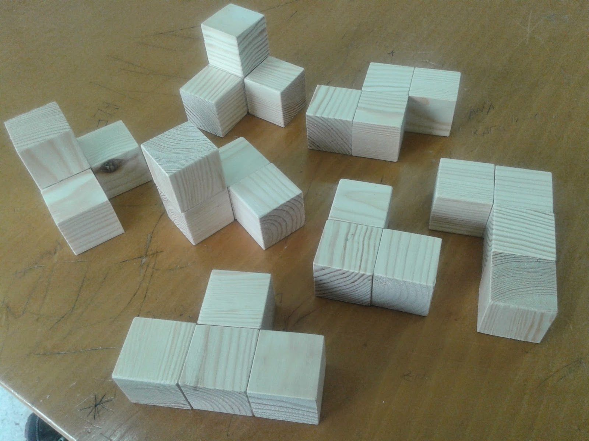

* Knobelwürfel



```scad
module baustein() {
    difference() {
        union() {
            cube([3, 1, 1]);
            translate([1, 1, 0])
                cube([1, 1, 1]);
        }
     
    }
}

module baustein_T() {
    difference() {
        union() {
           cube([1, 3, 1]);
                translate([0, 1, 1])
                cube(1);
                ;
        }
     
    }
}

module baustein_L() {
    difference() {
        union() {
           cube([1, 3, 1]);
                translate([0, 2, 1])
                cube(1);
                ;
        }
     
    }
}

module baustein_tL() {
    difference() {
        union() {
           cube([1, 2, 1]);
                translate([0, 1, 1])
                cube(1);
                ;
        }
     
    }
}
module baustein_C() {
    difference() {
        union() {
           cube([1, 2, 1]);
                translate([0, 1, 1])
           cube(1);
                translate([1, 1, 0])
           cube(1);
                ;
        }
     
    }
}

module baustein_Z() {
    difference() {
        union() {
           cube([1, 2, 1]);
                translate([1, 1, 0])
           cube([1,2,1]);
                ;
        }
     
    }
}

module baustein_S() {
    difference() {
        union() {
           cube([1, 2, 1]);
           translate([1, 0, 0])
                cube([1,1,2]);
        }
     
    }
}


module Zauberweurfel() {
    baustein_T();
        translate([2, 0, 0,])
    baustein_L();
        translate([4, 0, 0,])
    baustein_tL();
        translate([6, 0, 0,])     
    baustein_C();
        translate([9, 0, 0,])     
    baustein_Z();
        translate([12, 0, 0,])
    baustein_S();
}
     


scale([2,2,2])
    Zauberwuerfel();

    


```